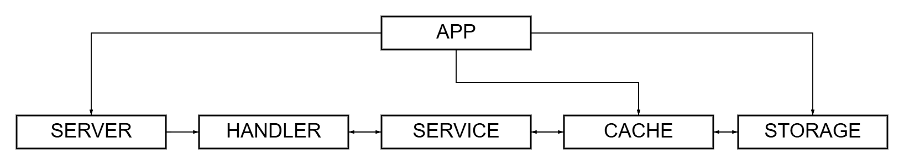

<h3 align="center">Robust URL shortener with custom aliases, Redis caching, PostgreSQL persistence, real-time visit tracking, and detailed analytics.</h3>

## 


<br>

## Table of Contents

- [Architecture](#architecture)
- [Installation](#installation)
- [Configuration](#configuration)
- [Shutting down](#shutting-down)
- [API](#api)
- [Validation](#validation)
- [Error mapping and error codes](#error-mapping-and-error-codes)
- [Request examples](#request-examples)

<br>

## Architecture

- **App** — the central orchestrator of the system.  
  Responsible for application bootstrap and lifecycle management. It loads configuration, initializes logger, database and Redis cache, wires all components (storage, service, handler, server) together, and controls startup and graceful shutdown using a shared context.

- **Handler** — HTTP request processing layer.  
  Registers API v1 routes and serves the static web frontend.

- **Service** — the application-level business logic layer.  
  Performs URL and alias validation, generates short links (base62 encoding or custom alias), coordinates cache-first lookups, records visits asynchronously, and fetches grouped analytics.

- **Cache** — auxiliary in-memory layer (Redis).  
  Stores original URLs with automatic expiration and refreshes TTL on every access to provide lightning-fast redirects and reduce database load.

- **Storage** — the persistent data layer and source of truth (PostgreSQL).  
  Stores short links, original URLs, and visit statistics. Implements all write operations (link creation, visit recording, analytics queries).



<br>

## Installation
⚠️ Note: This project requires Docker Compose, regardless of how you choose to run it.  

First, clone the repository and enter the project folder:

```bash
git clone https://github.com/Pur1st2EpicONE/Iris.git
cd Iris
```

Then you have two options:

#### 1. Run everything in containers
```bash
make
```

This will start the entire project fully containerized using Docker Compose.

#### 2. Run Iris locally
```bash
make local
```
In this mode, only PostgreSQL and Redis are started in containers via Docker Compose, while the application itself runs locally.

⚠️ Note:
Local mode requires Go 1.25.1 and the latest version of the migrate CLI tool installed on your machine.

<br>

## Configuration

### Runtime configuration

Iris uses two configuration files, depending on the selected run mode:

[config.full.yaml](./configs/config.full.yaml) — used for the fully containerized setup

[config.dev.yaml](./configs/config.dev.yaml) — used for local development

You may optionally review and adjust it to match your preferences. The default values are suitable for most use cases.

### Environment variables

Sensitive credentials are loaded from a .env file. If environment file does not exist, .env.example is copied to create it. If environment file already exists, it is used as-is and will not be overwritten.

⚠️ Note: Keep .env.example for local runs. Some Makefile commands rely on it and may break if it's missing.

<br>

## Shutting down

Stopping Iris depends on how it was started:

- Local setup — press Ctrl+C to send SIGINT to the application. The service will gracefully close connections and finish any in-progress operations.  
- Full Docker setup — containers run by Docker Compose will be stopped automatically.

In both cases, to stop all services and clean up containers, run:

```bash
make down
```

⚠️ Note: In the full Docker setup, the log folder is created by the container as root and will not be removed automatically. To delete it manually, run:
```bash
sudo rm -rf <log-folder>
```

⚠️ Note: Docker Compose also creates a persistent volume for PostgreSQL data (iris_postgres_data). This volume is not removed automatically when containers are stopped. To remove it and fully reset the environment, run:
```bash
make reset
```

<br>

## API

All endpoints are mounted under /api/v1. The root path / serves a clean HTML web interface with a form to shorten links and view analytics. Responses follow a simple wrapper convention:

- Success: **200 OK** with JSON body **{"result": \<value>}**
- Error: appropriate status code with JSON body **{"error": "\<message>"}**


<br>

### Shorten link

```bash
POST /api/v1/shorten
```

Request body example:
```json
{
    "original_url": "https://tech.wildberries.ru/",
    "alias": "wbt"
}
```

**original_url** (string, required) The full URL to be shortened

**alias** (string, optional) An optional custom short identifier


<br>

On success, the API returns 200 OK and link's identifier. Example:

```json
{
    "result": "wbt"
}
```

Typical error responses

- **400 Bad Request** — invalid JSON, validation failures (see [Validation](#Validation)).
- **500 Internal Server Error** — all internal failures.

<br>

### Redirect

```bash
GET /s/:short_url
```

Performs a 302 Found redirect to the original URL.
The visit is recorded asynchronously in the background (User-Agent is captured for analytics). No request body is required.


Typical responses:

- **302 Found** — successful redirect.
- **404 Not Found** — short link does not exist.

<br>

### Get analytics

```bash
GET /api/v1/analytics/:short_url?group_by=day
```

Query parameter: **group_by** (string, optional) — grouping optional. Supported values: "", day, month, user_agent.

On success, returns visit statistics for the given short URL.

<br>

## Validation

**original_url** — must be a valid URL using http or https scheme and must contain a host.

**alias** — maximum 32 characters. Allowed characters: A-Z, a-z, 0-9, -, _.

If a custom alias is provided and it already exists, the API returns **409 Conflict**.

<br>

## Error mapping and error codes

The API maps internal errors to appropriate HTTP status codes.

### 400 Bad Request

- **ErrInvalidJSON**: "invalid JSON format"
- **ErrInvalidOriginalURL**: "original_url is not a valid URL"
- **ErrOriginalURLScheme**: "original_url must use http or https scheme"
- **ErrOriginalURLHost**: "original_url must contain host"
- **ErrAliasTooLong**: "custom_alias length must be less than 32 characters"
- **ErrAliasInvalidChars**: "custom_alias contains invalid characters"
- **ErrInvalidGroupBy**: "invalid group_by parameter"

- **ErrSendAtInPast**: "send_at cannot be in the past"
- **ErrSendAtTooFar**: "send_at is too far in the future"
- **ErrMissingSendTo**: "send_to is required"
- **ErrMissingEmailSubject**: "email subject is required"
- **ErrEmailSubjectTooLong**: "email subject is too long"
- **ErrInvalidEmailFormat**: "invalid email format"
- **ErrCannotCancel**: "notification cannot be canceled in its current state"
- **ErrAlreadyCanceled**: "notification is already canceled"
- **ErrRecipientTooLong**: "recipient exceeds maximum length"

<br>

### 409 Conflict

- **ErrAliasExists**: "URL with this alias already exists"

<br>

### 404 Not Found

- **ErrLinkNotFound**: "short link not found"

<br>

### 500 Internal Server Error

- **ErrInternal**: "internal server error"

<br>
<br>

The error body for these cases follows the format:
```json
{ "error": "<error message>" }
```

<br>


## Request examples

⚠️ Note: When the service is running, a clean web-based UI is available at http://localhost:8080. The examples below show direct API usage with curl.

### Shorten with auto-generated short link

```bash
curl -X POST http://localhost:8080/api/v1/shorten \
  -H "Content-Type: application/json" \
  -d '{"original_url": "https://tech.wildberries.ru/"}'
```

### Response

```json
{
  "result": "EMJE"
}
```

<br>

### Shorten with custom alias

```bash
curl -X POST http://localhost:8080/api/v1/shorten \
  -H "Content-Type: application/json" \
  -d '{"original_url": "https://tech.wildberries.ru/", "alias": "wbt"}'
```

### Response

```json
{
  "result": "wbt"
}
```

<br>

### Redirect

```bash
curl -L http://localhost:8080/api/v1/s/wbt
```

<br>

### Get analytics (grouped by day)

```bash
curl "http://localhost:8080/api/v1/analytics/wbt?group_by=day"
```

### Response

```json
{
    "result": {
        "count": 3,
        "data": [
            {
                "key": "2026-03-29",
                "user_agent": "curl/8.5.0",
                "time": "2026-03-29T20:01:21.096027Z",
                "count": 1
            },
            {
                "key": "2026-03-29",
                "user_agent": "PostmanRuntime/7.51.1",
                "time": "2026-03-29T20:02:41.863132Z",
                "count": 1
            },
            {
                "key": "2026-03-29",
                "user_agent": "Mozilla/5.0 (Windows NT 10.0; Win64; x64)",
                "time": "2026-03-29T20:03:11.037832Z",
                "count": 1
            }
        ]
    }
}
```
